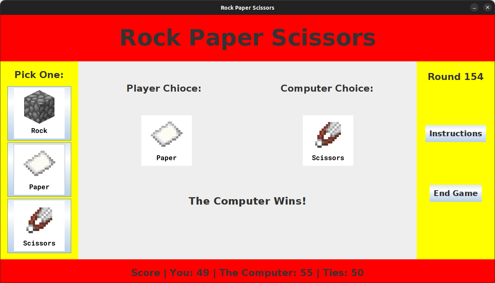

# rock-paper-scissors
A simple rock paper scissors game with a graphical user interface.

>The game is made in Java and is a simple rock paper scissors game with a graphical user interface. It records the score of the player and the computer and displays it on the screen. When exiting the game, the score is also saved to a file. The GUI was created using Swing.
> 
